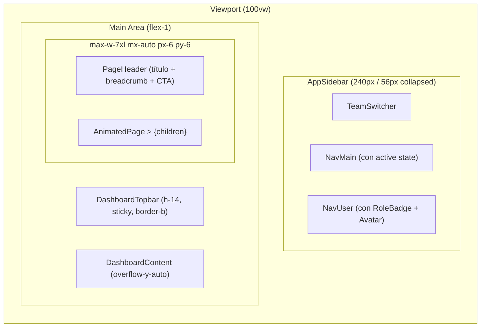
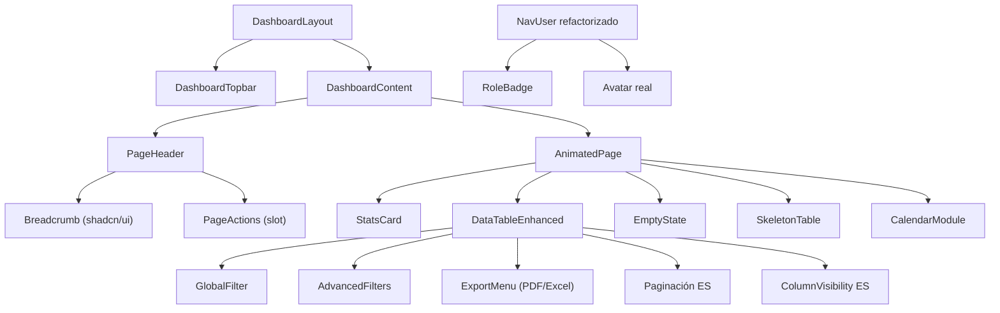
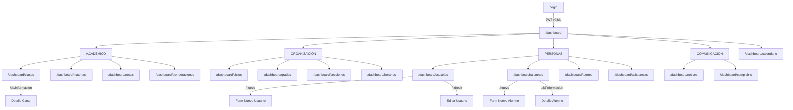
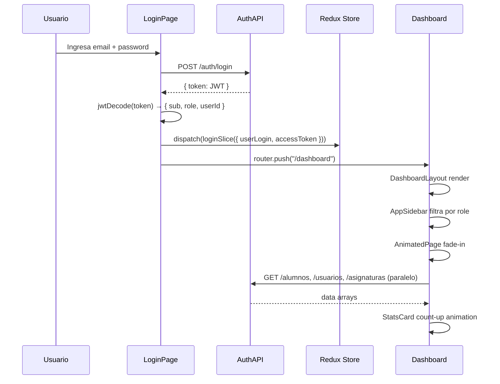

# Documento de Diseño: Transformación UX/UI — School Management System

> **Nivel:** SaaS Premium 2026 · **Stack:** Next.js 15 + React 19 + TypeScript + Tailwind v4 + shadcn/ui new-york  
> **Idioma del documento:** Español  
> **Tipo:** High-Level Design + Low-Level Design

---

## Overview

Sistema de gestión escolar (SMS) que requiere una transformación completa de UX/UI. El sistema ya tiene lógica de negocio funcional (12 módulos, 4 roles, API REST conectada) pero presenta 25 problemas críticos de UX/UI que degradan la experiencia. Este documento especifica el diseño técnico completo para elevar el producto a nivel SaaS premium 2026.

Ver sección [1. Visión General](#1-visión-general) para el análisis detallado.

## Architecture

El sistema sigue una arquitectura de **Shell + Módulos** sobre Next.js App Router: un layout de dashboard persistente (sidebar + topbar) que envuelve módulos intercambiables. Ver sección [3. Arquitectura de Layout](#3-arquitectura-de-layout) y el diagrama de componentes en [4. Arquitectura de Componentes](#4-arquitectura-de-componentes).

## Components and Interfaces

Los nuevos componentes y sus interfaces TypeScript se detallan en las secciones [10. Interfaces TypeScript](#10-interfaces-typescript) y [11. Estructura JSX](#11-estructura-jsx). Los componentes clave son: `DashboardLayout`, `PageHeader`, `StatsCard`, `DataTableEnhanced`, `EmptyState`, `SkeletonTable`, `CalendarModule`, `AnimatedPage`, `RoleBadge`, `ExportMenu`.

## Data Models

Los modelos de datos de calendario y configuración de exportación se encuentran definidos en las secciones [6.3](#63-tipos-de-eventos) y [10.5](#105-datatableenhanced) respectivamente. Los modelos de dominio (Alumno, Clase, etc.) ya existen en `types/*.ts` y no se modifican en esta feature.

## Correctness Properties

*Una propiedad es una característica o comportamiento que debe cumplirse en todas las ejecuciones válidas del sistema — esencialmente, una declaración formal sobre lo que el sistema debe hacer. Las propiedades sirven como puente entre las especificaciones legibles por humanos y las garantías de correctness verificables por máquinas.*

### Property 1: Sidebar — Solo ítems permitidos por rol

*Para cualquier* rol válido R ∈ {ROLE_ADMIN, ROLE_DOCENTE, ROLE_DIRECTIVO, ROLE_SUPERADMIN} y cualquier configuración de navegación, el sidebar filtrado no debe contener ningún ítem de nivel superior ni ningún subítem cuya propiedad `rol` no incluya R. La misma restricción aplica de forma recursiva a los subitems colapsables. El ítem de "Calendario" debe aparecer para todos los roles válidos sin excepción.

**Validates: Requirements 4.10, 6.9**

---

### Property 2: Detección correcta de ruta activa en NavMain

*Para cualquier* pathname válido del dashboard y cualquier ítem de navegación con URL `u`, la función `isActive(u, pathname)` debe retornar `true` si y solo si: (a) `u === "/dashboard"` y `pathname === "/dashboard"`, o (b) `u !== "/dashboard"` y (`pathname === u` o `pathname.startsWith(u + "/")`). Un ítem colapsable con un subítem activo debe tener `defaultOpen` igual a `true`.

**Validates: Requirements 4.1, 4.2, 4.4**

---

### Property 3: RoleBadge — Etiqueta, ícono y color correctos para cualquier rol válido

*Para cualquier* Rol_Valido pasado al componente `RoleBadge`, el componente debe renderizar: (a) la etiqueta de texto legible correcta cuando `iconOnly` es `false` (Super Admin, Admin, Directivo, Docente), (b) el ícono correspondiente de Lucide (ShieldCheck, Shield, Users, GraduationCap respectivamente), y (c) clases de color semántico distintas por rol (primary/info/warning/success). Cuando `iconOnly` es `false`, el texto debe estar siempre visible sin depender del soporte de íconos.

**Validates: Requirements 4.8, 4.9, 10.5**

---

### Property 4: Formularios — Nunca submit con datos inválidos según Zod

*Para cualquier* combinación de campos de entrada cuya validación `zodSchema.safeParse(data).success === false`, el handler `onSubmit` nunca es invocado. El botón de submit permanece habilitado visualmente pero React Hook Form previene la ejecución hasta que todos los campos pasen la validación del schema.

**Validates: Requirements 8.3**

---

### Property 5: Tablas — EmptyState siempre visible cuando `data.length === 0`

*Para cualquier* configuración de columnas (1–N columnas), cuando el array `data` pasado a `DataTableEnhanced` tiene longitud cero, el componente `EmptyState` es renderizado y el número de filas de datos en el `<tbody>` es exactamente cero. Esta propiedad se mantiene independientemente del número de columnas definidas, el valor de `searchPlaceholder` y la presencia o ausencia de `exportConfig`.

**Validates: Requirements 6.3**

---

### Property 6: Animaciones — No bloquean interactividad

*Para cualquier* elemento interactivo (botón, enlace, input) dentro de un wrapper `AnimatedPage` o `StatsCard`, el estilo computado `pointer-events` nunca es `"none"` una vez que el componente está montado en el DOM. El delay escalonado de `StatsCard` con `cardEntrance` para un índice `i` debe ser exactamente `i * 0.06` segundos, sin modificar la propiedad `pointer-events`.

**Validates: Requirements 7.3, 7.6**

---

### Property 7: Contraste WCAG 2.1 AA — Ratio ≥ 4.5:1

*Para cada* par de tokens semánticos definidos (`--success/--success-foreground`, `--warning/--warning-foreground`, `--info/--info-foreground`, `--primary/--primary-foreground`, `--destructive/--destructive-foreground`), la relación de contraste calculada según WCAG 2.1 es mayor o igual a 4.5:1 tanto en modo claro como en modo oscuro.

**Validates: Requirements 1.7, 11.1**

---

### Property 8: Layout responsive — Sin overflow en breakpoints definidos

*Para cada uno* de los breakpoints definidos [375px, 768px, 1024px, 1440px], el `document.body.scrollWidth` nunca supera el `document.body.clientWidth` en ninguna ruta del dashboard, garantizando ausencia de scroll horizontal no deseado.

**Validates: Requirements 12.4**

---

### Property 9: PageHeader — Renderiza título, descripción y breadcrumbs para cualquier input válido

*Para cualquier* combinación de props válidas de `PageHeader` (título no vacío, descripción opcional y lista de breadcrumbs de 0 a N items), el componente debe: (a) renderizar el título como elemento `h1` con clases `text-2xl font-semibold`, (b) renderizar la descripción en `text-sm text-muted-foreground` cuando está presente, y (c) renderizar el componente `Breadcrumb` con "Inicio" como primer ítem fijo más los items pasados cuando la lista tiene al menos un elemento.

**Validates: Requirements 3.7, 3.8**

---

### Property 10: useCountUp — Converge al valor objetivo para cualquier target positivo

*Para cualquier* número entero positivo `target` pasado al hook `useCountUp`, el valor retornado debe: (a) comenzar en 0 en el primer render, (b) incrementar monotónicamente, y (c) converger exactamente a `target` al completarse la duración de la animación.

**Validates: Requirements 5.4, 7.7**

---

### Property 11: StatsCard — Skeleton para cualquier props con isLoading=true

*Para cualquier* combinación de props del componente `StatsCard` donde `isLoading` es `true`, el componente debe renderizar el estado skeleton (bloques `Skeleton`) y no debe renderizar el valor numérico, el título ni el indicador de tendencia.

**Validates: Requirements 5.2, 5.3**

---

### Property 12: ActivityFeed — Un elemento renderizado por cada actividad en el input

*Para cualquier* lista de actividades recientes de longitud N (N ≥ 0) pasada al `ActivityFeed`, el componente debe renderizar exactamente N elementos en el feed. Cada elemento debe contener un avatar, la descripción de la acción y el timestamp relativo.

**Validates: Requirements 5.7**

Ver sección [16. Correctness Properties (PBT)](#16-correctness-properties) para la implementación completa con fast-check. Las propiedades fueron actualizadas para referenciar los requisitos formales del documento `requirements.md`.

## Error Handling

Los patrones de manejo de errores se abordan en:
- **Formularios:** sección [13.4](#134-redirect-con-feedback-reemplaza-settimeout9000) — reemplaza `setTimeout(9000)` por `toast.error` + `router.push` inmediato.
- **Tablas:** sección [11.5](#115-datatableenhanced) — `EmptyState` para datos vacíos, `SkeletonTable` para carga.
- **Páginas:** Fase 4, tareas 4.8–4.9 — `app/not-found.tsx` y `error.tsx` global.

## Testing Strategy

Las propiedades de correctness en la sección [16](#16-correctness-properties) cubren:
- **PBT con fast-check:** filtrado de sidebar por rol, validación de formularios Zod, empty state de tablas, contraste WCAG.
- **Integration tests:** animaciones no bloquean interactividad.
- **E2E con Playwright:** layout responsive en 4 breakpoints (375, 768, 1024, 1440px).

---

## Tabla de Contenidos

1. [Visión General](#1-visión-general)
2. [Sistema de Diseño (Design System)](#2-sistema-de-diseño)
3. [Arquitectura de Layout](#3-arquitectura-de-layout)
4. [Arquitectura de Componentes](#4-arquitectura-de-componentes)
5. [Dashboard Principal — KPIs y Widgets](#5-dashboard-principal)
6. [Módulo de Calendario](#6-módulo-de-calendario)
7. [Diagrama de Navegación](#7-diagrama-de-navegación)
8. [Sistema de Animaciones](#8-sistema-de-animaciones)
9. [Design Tokens (Low-Level)](#9-design-tokens)
10. [Interfaces TypeScript de Componentes Nuevos](#10-interfaces-typescript)
11. [Estructura JSX de Componentes Nuevos](#11-estructura-jsx)
12. [Refactorizaciones en Componentes Existentes](#12-refactorizaciones)
13. [Algoritmos y Lógica Core](#13-algoritmos-y-lógica)
14. [Plan de Migración](#14-plan-de-migración)
15. [Dependencias Nuevas](#15-dependencias-nuevas)
16. [Correctness Properties (PBT)](#16-correctness-properties)

---

## 1. Visión General

El sistema actual funciona correctamente a nivel de datos pero presenta una experiencia de usuario fragmentada, incompleta e inconsistente que degrada la percepción de calidad del producto. Los 25 problemas detectados (15 UX + 10 UI) se agrupan en seis ejes críticos:

1. **Estructura de layout rota** — `<main>` sin padding/max-width, topbar flotante sin contenedor, metadata hardcodeada.
2. **Dashboard vacío de valor** — sin KPIs reales, sin gráficos, sin actividad reciente.
3. **Tablas con errores funcionales** — filtro por columna `id` en lugar de nombre, textos en inglés.
4. **Feedback de usuario ausente** — sin skeletons, sin empty states, redirect con `setTimeout(9000)`.
5. **Módulos incompletos** — Comunicados y Reclamos sin páginas, sin calendario.
6. **Sistema visual incoherente** — sin tokens semánticos de estado, sin animaciones, tipografía mal cargada.

La transformación propuesta apunta a un nivel de calidad comparable a Linear, Vercel Dashboard o Notion: interfaces limpias, rápidas, con microinteracciones sutiles y total consistencia semántica.

---

## 2. Sistema de Diseño

### 2.1 Paleta de Colores Semántica

El sistema actual tiene `--primary` (azul), `--secondary` (verde) y `--accent` (rosa), pero carece de tokens de estado: `success`, `warning`, `info`. Esto obliga a usar `text-red-500` o `text-green-500` hardcodeados, rompiendo la coherencia en dark mode.

**Tokens nuevos a agregar:**

| Token semántico | Propósito | Valor Light (OKLCH) | Valor Dark (OKLCH) |
|---|---|---|---|
| `--success` | Operación exitosa | `oklch(0.640 0.150 145)` | `oklch(0.760 0.140 145)` |
| `--success-foreground` | Texto sobre success | `oklch(1 0 0)` | `oklch(0.130 0.040 145)` |
| `--warning` | Alertas / pendiente | `oklch(0.720 0.170 65)` | `oklch(0.820 0.150 65)` |
| `--warning-foreground` | Texto sobre warning | `oklch(0.200 0.040 65)` | `oklch(0.130 0.030 65)` |
| `--info` | Información neutral | `oklch(0.600 0.160 230)` | `oklch(0.720 0.140 230)` |
| `--info-foreground` | Texto sobre info | `oklch(1 0 0)` | `oklch(0.130 0.040 230)` |
| `--surface` | Background elevado nivel 1 | `oklch(0.990 0.002 248)` | `oklch(0.240 0.030 257)` |
| `--surface-2` | Background elevado nivel 2 | `oklch(0.975 0.003 248)` | `oklch(0.280 0.028 257)` |

**Razón WCAG:** Con los valores propuestos, el contraste texto/fondo supera 4.5:1 en todos los casos, cumpliendo WCAG 2.1 AA. El verde success en light tiene relación de contraste ≥ 4.8:1 sobre blanco.

### 2.2 Tipografía

**Problema actual:** `Inter` está declarada como `--font-sans: Inter` en el CSS pero **nunca se carga con `next/font`**. Esto provoca FOUT (Flash of Unstyled Text) y puede causar layout shifts.

**Solución:**

```typescript
// src/app/layout.tsx
import { Inter } from "next/font/google"

const inter = Inter({
  subsets: ["latin"],
  variable: "--font-sans",
  display: "swap",
  weight: ["400", "500", "600", "700"],
})

export default function RootLayout({ children }: { children: React.ReactNode }) {
  return (
    <html lang="es" suppressHydrationWarning className={inter.variable}>
      <body>{children}</body>
    </html>
  )
}
```

**Escala tipográfica (tokens adicionales):**

| Token | Tamaño | Line-height | Uso |
|---|---|---|---|
| `--text-xs` | 11px | 1.4 | Badges, metadata |
| `--text-sm` | 13px | 1.5 | Texto de tabla, labels |
| `--text-base` | 14px | 1.6 | Body principal |
| `--text-lg` | 16px | 1.5 | Subtítulos |
| `--text-xl` | 20px | 1.4 | Títulos de card |
| `--text-2xl` | 24px | 1.3 | Page titles |
| `--text-3xl` | 30px | 1.2 | KPI values |

### 2.3 Espaciado y Radio

```css
/* Espaciado base: 4px grid */
--spacing-1: 0.25rem;   /* 4px */
--spacing-2: 0.5rem;    /* 8px */
--spacing-3: 0.75rem;   /* 12px */
--spacing-4: 1rem;      /* 16px */
--spacing-6: 1.5rem;    /* 24px */
--spacing-8: 2rem;      /* 32px */
--spacing-12: 3rem;     /* 48px */
--spacing-16: 4rem;     /* 64px */

/* Radio */
--radius: 0.5rem;       /* 8px - base */
--radius-sm: 0.375rem;  /* 6px */
--radius-md: 0.5rem;    /* 8px */
--radius-lg: 0.75rem;   /* 12px */
--radius-xl: 1rem;      /* 16px */
--radius-2xl: 1.5rem;   /* 24px - modals, cards grandes */
--radius-full: 9999px;  /* badges, pills */
```

### 2.4 Sombras Premium

```css
/* Sombras rediseñadas para aspecto premium */
--shadow-card: 0 1px 3px 0 rgb(0 0 0 / 0.04), 0 1px 2px -1px rgb(0 0 0 / 0.04);
--shadow-card-hover: 0 4px 12px 0 rgb(0 0 0 / 0.08), 0 2px 4px -1px rgb(0 0 0 / 0.06);
--shadow-dropdown: 0 8px 24px -4px rgb(0 0 0 / 0.12), 0 2px 8px -2px rgb(0 0 0 / 0.08);
--shadow-modal: 0 24px 48px -12px rgb(0 0 0 / 0.18), 0 0 0 1px rgb(0 0 0 / 0.04);
--shadow-focus: 0 0 0 3px color-mix(in oklch, var(--primary) 25%, transparent);
```

---

## 3. Arquitectura de Layout

### 3.1 Estructura Actual (Problemática)

```
SidebarProvider
  ├── AppSidebar
  └── <main>                     ← sin padding, sin max-width, sin topbar
        ├── <SidebarTrigger />   ← flotando
        ├── <ModeToggle />       ← flotando
        └── {children}           ← sueltos
```

### 3.2 Estructura Propuesta

```
SidebarProvider
  ├── AppSidebar (refactorizado con active states + RoleBadge)
  └── DashboardLayout            ← nuevo wrapper
        ├── DashboardTopbar      ← header fijo con SidebarTrigger + breadcrumb + acciones globales
        └── DashboardContent     ← scroll area con padding + max-width
              ├── PageHeader     ← título + breadcrumb + acciones por página
              └── AnimatedPage   ← wrapper Framer Motion
                    └── {children}
```

### 3.3 Diagrama de Layout



### 3.4 Breakpoints Responsive

| Breakpoint | Comportamiento |
|---|---|
| `< 768px` (mobile) | Sidebar oculto por defecto, overlay al abrir. Topbar con menu hamburger. Content: `px-4 py-4` |
| `768px – 1023px` (tablet) | Sidebar en modo icono (56px). Content: `px-5 py-5` |
| `1024px – 1439px` (desktop) | Sidebar expandido (240px). Content: `px-6 py-6`, `max-w-6xl` |
| `≥ 1440px` (wide) | Sidebar 240px. Content: `px-8 py-8`, `max-w-7xl` |

---

## 4. Arquitectura de Componentes

### 4.1 Mapa de Componentes Nuevos



### 4.2 Componentes a Crear vs Refactorizar

| Componente | Tipo | Ruta destino |
|---|---|---|
| `DashboardLayout` | Nuevo | `src/components/layout/DashboardLayout.tsx` |
| `DashboardTopbar` | Nuevo | `src/components/layout/DashboardTopbar.tsx` |
| `PageHeader` | Nuevo | `src/components/layout/PageHeader.tsx` |
| `StatsCard` | Nuevo | `src/components/dashboard/StatsCard.tsx` |
| `DashboardKPIs` | Nuevo | `src/components/dashboard/DashboardKPIs.tsx` |
| `ActivityFeed` | Nuevo | `src/components/dashboard/ActivityFeed.tsx` |
| `DataTableEnhanced` | Nuevo | `src/components/shared/DataTableEnhanced.tsx` |
| `EmptyState` | Nuevo | `src/components/shared/EmptyState.tsx` |
| `SkeletonTable` | Nuevo | `src/components/shared/SkeletonTable.tsx` |
| `SkeletonCard` | Nuevo | `src/components/shared/SkeletonCard.tsx` |
| `CalendarModule` | Nuevo | `src/components/calendar/CalendarModule.tsx` |
| `AnimatedPage` | Nuevo | `src/components/layout/AnimatedPage.tsx` |
| `RoleBadge` | Nuevo | `src/components/shared/RoleBadge.tsx` |
| `StatusBadge` | Nuevo | `src/components/shared/StatusBadge.tsx` |
| `ExportMenu` | Nuevo | `src/components/shared/ExportMenu.tsx` |
| `app-sidebar.tsx` | Refactorizar | `src/components/app-sidebar.tsx` |
| `nav-main.tsx` | Refactorizar | `src/components/nav-main.tsx` |
| `nav-user.tsx` | Refactorizar | `src/components/nav-user.tsx` |
| `dashboard/layout.tsx` | Refactorizar | `src/app/dashboard/layout.tsx` |
| `homeAdmin.tsx` | Refactorizar | `src/components/home/homeAdmin.tsx` |
| `data-table.tsx` (todos los módulos) | Reemplazar | por `DataTableEnhanced` |
| `globals.css` | Ampliar | tokens semánticos + fuente |
| `app/layout.tsx` | Actualizar | `next/font`, metadata, favicon |

---

## 5. Dashboard Principal

### 5.1 Layout del Dashboard por Rol

#### ROLE_ADMIN / ROLE_DIRECTIVO / ROLE_SUPERADMIN

```
┌─────────────────────────────────────────────────────┐
│  PageHeader: "Panel de Control"  [Hoy: dd/mm/yyyy]  │
├──────────┬──────────┬──────────┬───────────────────-┤
│ StatsCard│ StatsCard│ StatsCard│ StatsCard           │
│ Alumnos  │ Docentes │ Clases   │ Asistencia Hoy      │
├─────────────────────────┬───────────────────────────┤
│  Gráfico: Asistencia    │  Gráfico: Notas promedio  │
│  (BarChart 30 días)     │  por Grado (RadarChart)   │
├─────────────────────────┴───────────────────────────┤
│  Actividad Reciente (feed temporal de acciones)     │
│  ┌──────────┬─────────────────────────────────────┐ │
│  │ Avatar   │ "Juan García registró asistencia..." │ │
│  │ Avatar   │ "María López fue matriculada en..."  │ │
│  └──────────┴─────────────────────────────────────┘ │
├─────────────────────────────────────────────────────┤
│  Accesos Rápidos (shortcuts a módulos frecuentes)   │
└─────────────────────────────────────────────────────┘
```

#### ROLE_DOCENTE

```
┌─────────────────────────────────────────────────────┐
│  PageHeader: "Bienvenido, {nombre}"                 │
├──────────┬──────────┬──────────┬───────────────────-┤
│ Mis      │ Alumnos  │ Pend.    │ Próxima             │
│ Clases   │ Activos  │ Calificar│ Clase               │
├─────────────────────────────────────────────────────┤
│  Mis Clases hoy (mini-calendario semanal)           │
├─────────────────────────────────────────────────────┤
│  Tabla: Últimas notas registradas                   │
└─────────────────────────────────────────────────────┘
```

### 5.2 StatsCard — Anatomía

Cada KPI card contiene:
- **Icono** (24px, color semántico con bg suave)
- **Valor principal** (texto-3xl, font-bold)
- **Label** (texto-sm, muted-foreground)
- **Tendencia** (±% vs período anterior, con flecha + color success/destructive)
- **Mini sparkline** (opcional, recharts LineChart tiny)
- **Skeleton** cuando carga

### 5.3 Gráficos Propuestos (Recharts)

| Gráfico | Tipo | Datos | Módulo |
|---|---|---|---|
| Asistencia últimos 30 días | `BarChart` agrupado | Presentes/Ausentes/Tardanzas por día | Dashboard Admin |
| Notas promedio por grado | `RadarChart` | Promedio por materia en cada grado | Dashboard Admin |
| Distribución de alumnos por grado | `PieChart` | Cantidad alumnos/grado | Dashboard Admin |
| Mis calificaciones registradas | `AreaChart` | Calificaciones por semana | Dashboard Docente |

### 5.4 Accesos Rápidos (Quick Actions)

Grid de 4–6 tarjetas pequeñas con icono + label → link directo a acciones frecuentes según rol:

| Admin/Directivo | Docente |
|---|---|
| Nuevo alumno | Registrar asistencia |
| Nuevo usuario | Cargar notas |
| Ver asistencias hoy | Mis clases |
| Gestionar notas | Ver alumnos |

---

## 6. Módulo de Calendario

### 6.1 Ubicación

- **Ruta:** `/dashboard/calendario`
- **Entrada en sidebar:** Grupo "Organización", icono `CalendarDays`, visible para todos los roles.
- **Vista adicional embebida** en el Dashboard (mini calendario semanal de clases del docente).

### 6.2 Vistas del Calendario

| Vista | Descripción | Rol |
|---|---|---|
| `month` | Vista mensual con eventos por día | Admin, Directivo, Superadmin |
| `week` | Vista semanal con franjas horarias | Todos |
| `day` | Vista diaria detallada | Todos |
| `agenda` | Lista cronológica de eventos | Todos |

### 6.3 Tipos de Eventos

```typescript
type CalendarEventType = 
  | "clase"       // color: primary
  | "examen"      // color: warning
  | "feriado"     // color: destructive
  | "reunion"     // color: info
  | "comunicado"  // color: secondary

interface CalendarEvent {
  id: string
  title: string
  start: Date
  end: Date
  type: CalendarEventType
  description?: string
  claseId?: number
  createdBy?: number
  allDay?: boolean
}
```

### 6.4 Integración

- Eventos de **Horarios** → se sincronizan automáticamente desde `horarioApi`.
- Eventos de **Asistencias** → se marcan los días con asistencia registrada.
- Soporte para crear eventos rápidos desde el calendario (modal `EventForm`).

### 6.5 Librería Recomendada

**`@schedule-x/react`** (0.x) en lugar de FullCalendar — menor bundle, API más limpia, soporte Tailwind nativo.

Alternativa: implementar un calendario custom con `react-day-picker` para el mini-calendario y la vista de semana con CSS Grid propio (sin dependencia extra).

**Decisión tomada:** Implementar la vista mensual y semanal con **`react-big-calendar`** (peer con `date-fns`) ya que `date-fns` ya es una dependencia del proyecto. Bundle adicional ~45KB gzip.

```
pnpm add react-big-calendar
pnpm add -D @types/react-big-calendar
```

---

## 7. Diagrama de Navegación



### 7.1 Estados de Navegación Activa

El `nav-main.tsx` actual no detecta la ruta activa. La refactorización añade:

```typescript
import { usePathname } from "next/navigation"

// Dentro del componente
const pathname = usePathname()
const isActive = (url: string) => pathname === url || pathname.startsWith(url + "/")
```

Cada `SidebarMenuButton` y `SidebarMenuSubButton` recibe `isActive` → aplica estilos `data-[active=true]:bg-sidebar-accent data-[active=true]:text-sidebar-accent-foreground`.

---

## 8. Sistema de Animaciones

### 8.1 Principios

Las animaciones siguen el principio de **"purposeful motion"**: cada animación refuerza la jerarquía, la causalidad o el estado. Jamás son decorativas puras. Umbrales:

- **Microinteracciones:** 100–200ms, `ease-out`
- **Transiciones de página:** 200–300ms, `ease-in-out`
- **Elementos que entran:** 300–400ms con stagger de 50ms
- **Feedback de carga:** perpetuo pero ligero (skeleton shimmer, spinner 16px)

Se respeta `prefers-reduced-motion`: todas las animaciones se deshabilitan si el usuario lo solicita.

### 8.2 Qué Animar con Framer Motion

| Elemento | Animación | Duración | Variante |
|---|---|---|---|
| Cambio de página | `opacity: 0→1` + `translateY: 8px→0` | 250ms | `pageTransition` |
| StatsCard (entrada) | `opacity: 0→1` + `scale: 0.96→1`, stagger 60ms | 300ms | `cardEntrance` |
| Sidebar item hover | `translateX: 0→2px` | 120ms | CSS (tw) |
| Modal open | `scale: 0.95→1` + `opacity: 0→1` | 200ms | radix built-in |
| EmptyState | `opacity: 0→1` + `translateY: 16px→0` | 400ms | `emptyEntrance` |
| Toast (sonner) | Ya maneja Sonner internamente | — | — |
| Form submit success | Checkmark animado SVG | 600ms | `checkmark` |
| Tabla rows (carga) | Stagger fade-in por fila | 30ms/row | `tableRow` |
| Números KPI | Count-up animation | 800ms | `useCountUp` hook |

### 8.3 Variantes Framer Motion

```typescript
// src/lib/animations.ts
import { Variants } from "framer-motion"

export const pageTransition: Variants = {
  hidden:  { opacity: 0, y: 8 },
  visible: { opacity: 1, y: 0, transition: { duration: 0.25, ease: "easeOut" } },
  exit:    { opacity: 0, y: -8, transition: { duration: 0.15 } },
}

export const cardEntrance: Variants = {
  hidden:  { opacity: 0, scale: 0.96 },
  visible: (i: number) => ({
    opacity: 1,
    scale: 1,
    transition: { duration: 0.3, delay: i * 0.06, ease: "easeOut" },
  }),
}

export const staggerContainer: Variants = {
  hidden:  {},
  visible: { transition: { staggerChildren: 0.05 } },
}

export const fadeInUp: Variants = {
  hidden:  { opacity: 0, y: 16 },
  visible: { opacity: 1, y: 0, transition: { duration: 0.35, ease: "easeOut" } },
}
```

### 8.4 Hook `useCountUp`

```typescript
// src/hooks/useCountUp.ts
import { useEffect, useState } from "react"

export function useCountUp(target: number, duration = 800): number {
  const [value, setValue] = useState(0)
  
  useEffect(() => {
    if (target === 0) return
    const start = performance.now()
    const tick = (now: number) => {
      const elapsed = now - start
      const progress = Math.min(elapsed / duration, 1)
      // easeOutCubic
      const eased = 1 - Math.pow(1 - progress, 3)
      setValue(Math.round(eased * target))
      if (progress < 1) requestAnimationFrame(tick)
    }
    requestAnimationFrame(tick)
  }, [target, duration])
  
  return value
}
```

---

## 9. Design Tokens

Bloque completo a agregar/reemplazar en `src/app/globals.css`:

```css
/* ─────────────────────────────────────────────────────────
   DESIGN TOKENS ADICIONALES — SMS Design System 2026
   Agregar dentro de :root y .dark respectivamente
   ───────────────────────────────────────────────────────── */

:root {
  /* Colores semánticos de estado */
  --success:             oklch(0.640 0.150 145.0);
  --success-foreground:  oklch(1.000 0.000   0.0);
  --success-muted:       oklch(0.940 0.060 145.0);
  --warning:             oklch(0.720 0.170  65.0);
  --warning-foreground:  oklch(0.200 0.040  65.0);
  --warning-muted:       oklch(0.960 0.060  65.0);
  --info:                oklch(0.600 0.160 230.0);
  --info-foreground:     oklch(1.000 0.000   0.0);
  --info-muted:          oklch(0.930 0.060 230.0);

  /* Superficies elevadas */
  --surface:             oklch(0.990 0.002 248.0);
  --surface-2:           oklch(0.975 0.003 248.0);
  --surface-foreground:  oklch(0.278 0.030 256.8);

  /* Sombras premium */
  --shadow-card:         0 1px 3px 0 rgb(0 0 0 / 0.04),
                         0 1px 2px -1px rgb(0 0 0 / 0.04);
  --shadow-card-hover:   0 4px 12px 0 rgb(0 0 0 / 0.08),
                         0 2px 4px -1px rgb(0 0 0 / 0.06);
  --shadow-dropdown:     0 8px 24px -4px rgb(0 0 0 / 0.12),
                         0 2px 8px -2px rgb(0 0 0 / 0.08);
  --shadow-modal:        0 24px 48px -12px rgb(0 0 0 / 0.18),
                         0 0 0 1px rgb(0 0 0 / 0.04);
  --shadow-focus:        0 0 0 3px color-mix(in oklch, var(--primary) 25%, transparent);

  /* Tipografía */
  --font-size-xs:   0.6875rem;  /* 11px */
  --font-size-sm:   0.8125rem;  /* 13px */
  --font-size-base: 0.875rem;   /* 14px */
  --font-size-lg:   1rem;       /* 16px */
  --font-size-xl:   1.25rem;    /* 20px */
  --font-size-2xl:  1.5rem;     /* 24px */
  --font-size-3xl:  1.875rem;   /* 30px */

  /* Topbar */
  --topbar-height: 3.5rem;      /* 56px */

  /* Sidebar */
  --sidebar-width:          15rem;  /* 240px */
  --sidebar-width-icon:     3.5rem; /* 56px */
}

.dark {
  --success:             oklch(0.760 0.140 145.0);
  --success-foreground:  oklch(0.130 0.040 145.0);
  --success-muted:       oklch(0.250 0.060 145.0);
  --warning:             oklch(0.820 0.150  65.0);
  --warning-foreground:  oklch(0.130 0.030  65.0);
  --warning-muted:       oklch(0.280 0.060  65.0);
  --info:                oklch(0.720 0.140 230.0);
  --info-foreground:     oklch(0.130 0.040 230.0);
  --info-muted:          oklch(0.250 0.060 230.0);

  --surface:             oklch(0.240 0.030 257.0);
  --surface-2:           oklch(0.280 0.028 257.0);
  --surface-foreground:  oklch(0.967 0.003 264.5);
}

/* Registrar tokens en @theme inline para uso con Tailwind */
@theme inline {
  --color-success:            var(--success);
  --color-success-foreground: var(--success-foreground);
  --color-success-muted:      var(--success-muted);
  --color-warning:            var(--warning);
  --color-warning-foreground: var(--warning-foreground);
  --color-warning-muted:      var(--warning-muted);
  --color-info:               var(--info);
  --color-info-foreground:    var(--info-foreground);
  --color-info-muted:         var(--info-muted);
  --color-surface:            var(--surface);
  --color-surface-2:          var(--surface-2);
  --color-surface-foreground: var(--surface-foreground);
}
```

---

## 10. Interfaces TypeScript de Componentes Nuevos

### 10.1 `DashboardLayout`

```typescript
// src/components/layout/DashboardLayout.tsx
interface DashboardLayoutProps {
  children: React.ReactNode
}
```

### 10.2 `DashboardTopbar`

```typescript
// src/components/layout/DashboardTopbar.tsx
interface DashboardTopbarProps {
  /** Slot para acciones globales en el lado derecho */
  actions?: React.ReactNode
}
```

### 10.3 `PageHeader`

```typescript
// src/components/layout/PageHeader.tsx
interface BreadcrumbItem {
  label: string
  href?: string
}

interface PageHeaderProps {
  /** Título principal de la página */
  title: string
  /** Descripción opcional debajo del título */
  description?: string
  /** Items del breadcrumb. El último es siempre el activo (sin href) */
  breadcrumbs?: BreadcrumbItem[]
  /** Slot para botones de acción (Nuevo, Exportar, etc.) */
  actions?: React.ReactNode
  /** Clase CSS adicional */
  className?: string
}
```

### 10.4 `StatsCard`

```typescript
// src/components/dashboard/StatsCard.tsx
import { LucideIcon } from "lucide-react"

type TrendDirection = "up" | "down" | "neutral"

interface StatsCardProps {
  /** Título de la métrica */
  title: string
  /** Valor numérico o string (ej: "1,234" o "87%") */
  value: number | string
  /** Icono de lucide-react */
  icon: LucideIcon
  /** Color semántico del ícono */
  iconColor?: "primary" | "success" | "warning" | "destructive" | "info"
  /** Porcentaje de variación vs período anterior */
  trend?: number
  /** Período de comparación para el trend */
  trendLabel?: string
  /** Animar el valor con count-up */
  animate?: boolean
  /** Estado de carga */
  isLoading?: boolean
  /** Click handler para navegar al módulo */
  onClick?: () => void
  /** Sparkline data (últimos 7 valores) */
  sparklineData?: number[]
}
```

### 10.5 `DataTableEnhanced`

```typescript
// src/components/shared/DataTableEnhanced.tsx
import { ColumnDef, Table as TanTable } from "@tanstack/react-table"

interface ExportConfig {
  filename: string
  /** Columnas a incluir en la exportación (por accessor key) */
  columns: string[]
  /** Título que aparece en el PDF */
  pdfTitle?: string
}

interface DataTableEnhancedProps<TData, TValue> {
  columns: ColumnDef<TData, TValue>[]
  data: TData[]
  /** Placeholder del input de búsqueda global */
  searchPlaceholder?: string
  /** Columna sobre la que aplica el filtro global (default: primera string column) */
  searchColumn?: string
  /** Habilitar búsqueda en TODAS las columnas simultáneamente */
  globalSearch?: boolean
  /** Config de exportación PDF/Excel */
  exportConfig?: ExportConfig
  /** Botón/slot de acción primaria (ej: "Nuevo Alumno") */
  primaryAction?: React.ReactNode
  /** Acciones adicionales en la toolbar */
  toolbarActions?: React.ReactNode
  /** Número de filas por página. Default: 10 */
  pageSize?: number
  /** Estado de carga — muestra SkeletonTable */
  isLoading?: boolean
  /** Mensaje cuando no hay datos */
  emptyStateProps?: EmptyStateProps
  /** Deshabilitar selección de filas */
  disableRowSelection?: boolean
  /** Callback al cambiar selección */
  onRowSelectionChange?: (rows: TData[]) => void
}
```

### 10.6 `EmptyState`

```typescript
// src/components/shared/EmptyState.tsx
import { LucideIcon } from "lucide-react"

interface EmptyStateProps {
  icon?: LucideIcon
  title: string
  description?: string
  /** Botón de acción principal */
  action?: {
    label: string
    onClick: () => void
    variant?: "default" | "outline" | "ghost"
  }
  /** Imagen/ilustración SVG opcional */
  illustration?: React.ReactNode
  className?: string
}
```

### 10.7 `SkeletonTable`

```typescript
// src/components/shared/SkeletonTable.tsx
interface SkeletonTableProps {
  /** Número de filas a mostrar */
  rows?: number
  /** Número de columnas a mostrar */
  columns?: number
  /** Mostrar toolbar skeleton (search + buttons) */
  showToolbar?: boolean
  /** Mostrar paginación skeleton */
  showPagination?: boolean
}
```

### 10.8 `CalendarModule`

```typescript
// src/components/calendar/CalendarModule.tsx

type CalendarView = "month" | "week" | "day" | "agenda"
type CalendarEventType = "clase" | "examen" | "feriado" | "reunion" | "comunicado"

interface CalendarEvent {
  id: string
  title: string
  start: Date
  end: Date
  type: CalendarEventType
  description?: string
  claseId?: number
  allDay?: boolean
  createdBy?: number
}

interface CalendarModuleProps {
  /** Eventos iniciales (pueden venir de API) */
  events?: CalendarEvent[]
  /** Vista por defecto */
  defaultView?: CalendarView
  /** Permitir crear nuevos eventos */
  allowCreate?: boolean
  /** Callback al crear un evento */
  onEventCreate?: (event: Omit<CalendarEvent, "id">) => Promise<void>
  /** Callback al hacer click en un evento */
  onEventClick?: (event: CalendarEvent) => void
  /** Estado de carga */
  isLoading?: boolean
  /** Filtrar eventos por tipo */
  visibleTypes?: CalendarEventType[]
}
```

### 10.9 `AnimatedPage`

```typescript
// src/components/layout/AnimatedPage.tsx
interface AnimatedPageProps {
  children: React.ReactNode
  /** Clave única para forzar re-animación en cambio de ruta */
  routeKey?: string
  className?: string
}
```

### 10.10 `RoleBadge`

```typescript
// src/components/shared/RoleBadge.tsx
type UserRole = "ROLE_ADMIN" | "ROLE_DOCENTE" | "ROLE_DIRECTIVO" | "ROLE_SUPERADMIN"

interface RoleBadgeProps {
  role: UserRole
  /** Mostrar solo el ícono (para sidebar colapsado) */
  iconOnly?: boolean
  className?: string
}
```

### 10.11 `ExportMenu`

```typescript
// src/components/shared/ExportMenu.tsx
interface ExportMenuProps {
  /** Datos a exportar */
  data: Record<string, unknown>[]
  /** Configuración por formato */
  config: {
    filename: string
    columns: Array<{ key: string; header: string; width?: number }>
    pdfTitle?: string
    pdfSubtitle?: string
  }
  /** Callback al iniciar exportación */
  onExportStart?: (format: "pdf" | "excel") => void
  /** Callback al completar exportación */
  onExportComplete?: (format: "pdf" | "excel") => void
  disabled?: boolean
}
```

---

## 11. Estructura JSX de Componentes Nuevos

### 11.1 `DashboardLayout`

```tsx
// src/components/layout/DashboardLayout.tsx
"use client"
import { SidebarInset } from "@/components/ui/sidebar"

export function DashboardLayout({ children }: DashboardLayoutProps) {
  return (
    <SidebarInset className="flex flex-col min-h-screen">
      <DashboardTopbar />
      <main className="flex-1 overflow-y-auto bg-surface">
        <div className="max-w-7xl mx-auto px-4 sm:px-6 lg:px-8 py-6">
          {children}
        </div>
      </main>
    </SidebarInset>
  )
}
```

### 11.2 `DashboardTopbar`

```tsx
// src/components/layout/DashboardTopbar.tsx
"use client"
import { SidebarTrigger } from "@/components/ui/sidebar"
import { Separator } from "@/components/ui/separator"
import { ModeToggle } from "@/components/mode-toggle"
import { DynamicBreadcrumb } from "./DynamicBreadcrumb"

export function DashboardTopbar({ actions }: DashboardTopbarProps) {
  return (
    <header className="sticky top-0 z-40 flex h-14 items-center gap-3 border-b border-border/50 bg-background/80 backdrop-blur-md px-4">
      <SidebarTrigger className="-ml-1" />
      <Separator orientation="vertical" className="h-5 opacity-50" />
      <DynamicBreadcrumb />
      <div className="ml-auto flex items-center gap-2">
        {actions}
        <ModeToggle />
        {/* Notificaciones futuras aquí */}
      </div>
    </header>
  )
}
```

### 11.3 `PageHeader`

```tsx
// src/components/layout/PageHeader.tsx
import { Breadcrumb, BreadcrumbItem, BreadcrumbLink,
         BreadcrumbList, BreadcrumbPage, BreadcrumbSeparator } from "@/components/ui/breadcrumb"

export function PageHeader({ title, description, breadcrumbs, actions, className }: PageHeaderProps) {
  return (
    <div className={cn("flex flex-col gap-4 pb-6", className)}>
      {breadcrumbs && breadcrumbs.length > 0 && (
        <Breadcrumb>
          <BreadcrumbList>
            <BreadcrumbItem>
              <BreadcrumbLink href="/dashboard">Inicio</BreadcrumbLink>
            </BreadcrumbItem>
            {breadcrumbs.map((crumb, i) => (
              <React.Fragment key={i}>
                <BreadcrumbSeparator />
                <BreadcrumbItem>
                  {crumb.href ? (
                    <BreadcrumbLink href={crumb.href}>{crumb.label}</BreadcrumbLink>
                  ) : (
                    <BreadcrumbPage>{crumb.label}</BreadcrumbPage>
                  )}
                </BreadcrumbItem>
              </React.Fragment>
            ))}
          </BreadcrumbList>
        </Breadcrumb>
      )}
      <div className="flex items-center justify-between gap-4">
        <div className="space-y-1">
          <h1 className="text-2xl font-semibold tracking-tight">{title}</h1>
          {description && (
            <p className="text-sm text-muted-foreground">{description}</p>
          )}
        </div>
        {actions && (
          <div className="flex items-center gap-2 flex-shrink-0">
            {actions}
          </div>
        )}
      </div>
    </div>
  )
}
```

### 11.4 `StatsCard`

```tsx
// src/components/dashboard/StatsCard.tsx
"use client"
import { motion } from "framer-motion"
import { TrendingUp, TrendingDown, Minus } from "lucide-react"
import { Card, CardContent } from "@/components/ui/card"
import { Skeleton } from "@/components/ui/skeleton"
import { useCountUp } from "@/hooks/useCountUp"
import { cardEntrance } from "@/lib/animations"
import { cn } from "@/lib/utils"

const iconColorMap = {
  primary:     "bg-primary/10 text-primary",
  success:     "bg-success-muted text-success",
  warning:     "bg-warning-muted text-warning",
  destructive: "bg-destructive/10 text-destructive",
  info:        "bg-info-muted text-info",
}

export function StatsCard({
  title, value, icon: Icon, iconColor = "primary",
  trend, trendLabel = "vs mes anterior", animate = true,
  isLoading, onClick, index = 0,
}: StatsCardProps & { index?: number }) {
  const numericValue = typeof value === "number" ? value : NaN
  const displayValue = animate && !isNaN(numericValue)
    ? useCountUp(numericValue)
    : value

  const trendIcon = trend && trend > 0 ? TrendingUp : trend && trend < 0 ? TrendingDown : Minus
  const trendColor = trend && trend > 0 ? "text-success" : trend && trend < 0 ? "text-destructive" : "text-muted-foreground"

  if (isLoading) {
    return (
      <Card className="p-5">
        <Skeleton className="h-8 w-8 rounded-lg mb-3" />
        <Skeleton className="h-8 w-24 mb-2" />
        <Skeleton className="h-4 w-32" />
      </Card>
    )
  }

  return (
    <motion.div custom={index} variants={cardEntrance} initial="hidden" animate="visible">
      <Card
        className={cn(
          "p-5 cursor-default transition-shadow hover:shadow-[var(--shadow-card-hover)]",
          onClick && "cursor-pointer"
        )}
        onClick={onClick}
      >
        <CardContent className="p-0 space-y-3">
          <div className={cn("w-10 h-10 rounded-lg flex items-center justify-center", iconColorMap[iconColor])}>
            <Icon size={20} />
          </div>
          <div>
            <p className="text-3xl font-bold tracking-tight">{displayValue}</p>
            <p className="text-sm text-muted-foreground mt-0.5">{title}</p>
          </div>
          {trend !== undefined && (
            <div className={cn("flex items-center gap-1 text-xs", trendColor)}>
              {React.createElement(trendIcon, { size: 12 })}
              <span>{Math.abs(trend)}% {trendLabel}</span>
            </div>
          )}
        </CardContent>
      </Card>
    </motion.div>
  )
}
```

### 11.5 `EmptyState`

```tsx
// src/components/shared/EmptyState.tsx
import { motion } from "framer-motion"
import { InboxIcon } from "lucide-react"
import { Button } from "@/components/ui/button"
import { fadeInUp } from "@/lib/animations"
import { cn } from "@/lib/utils"

export function EmptyState({
  icon: Icon = InboxIcon, title, description,
  action, illustration, className,
}: EmptyStateProps) {
  return (
    <motion.div
      variants={fadeInUp}
      initial="hidden"
      animate="visible"
      className={cn(
        "flex flex-col items-center justify-center py-16 px-6 text-center",
        className
      )}
    >
      {illustration ?? (
        <div className="w-16 h-16 rounded-2xl bg-muted flex items-center justify-center mb-5">
          <Icon size={28} className="text-muted-foreground" />
        </div>
      )}
      <h3 className="text-base font-semibold text-foreground mb-1">{title}</h3>
      {description && (
        <p className="text-sm text-muted-foreground max-w-sm mb-5">{description}</p>
      )}
      {action && (
        <Button variant={action.variant ?? "default"} onClick={action.onClick} size="sm">
          {action.label}
        </Button>
      )}
    </motion.div>
  )
}
```

### 11.6 `SkeletonTable`

```tsx
// src/components/shared/SkeletonTable.tsx
import { Skeleton } from "@/components/ui/skeleton"

export function SkeletonTable({
  rows = 8, columns = 5,
  showToolbar = true, showPagination = true,
}: SkeletonTableProps) {
  return (
    <div className="space-y-4">
      {showToolbar && (
        <div className="flex items-center gap-3">
          <Skeleton className="h-9 w-64" />
          <Skeleton className="h-9 w-24 ml-auto" />
          <Skeleton className="h-9 w-24" />
        </div>
      )}
      <div className="rounded-lg border border-border overflow-hidden">
        {/* Header */}
        <div className="flex gap-4 p-3 bg-muted/40 border-b border-border">
          {Array.from({ length: columns }).map((_, i) => (
            <Skeleton key={i} className="h-4" style={{ flex: i === 0 ? "0 0 20px" : 1 }} />
          ))}
        </div>
        {/* Rows */}
        {Array.from({ length: rows }).map((_, rowIdx) => (
          <div
            key={rowIdx}
            className={cn(
              "flex gap-4 p-3 border-b border-border last:border-0",
              rowIdx % 2 === 0 ? "bg-background" : "bg-muted/20"
            )}
          >
            {Array.from({ length: columns }).map((_, colIdx) => (
              <Skeleton
                key={colIdx}
                className="h-4 rounded"
                style={{ flex: colIdx === 0 ? "0 0 20px" : 1, animationDelay: `${rowIdx * 50}ms` }}
              />
            ))}
          </div>
        ))}
      </div>
      {showPagination && (
        <div className="flex justify-end gap-2">
          <Skeleton className="h-9 w-20" />
          <Skeleton className="h-9 w-8" />
          <Skeleton className="h-9 w-8" />
          <Skeleton className="h-9 w-20" />
        </div>
      )}
    </div>
  )
}
```

### 11.7 `AnimatedPage`

```tsx
// src/components/layout/AnimatedPage.tsx
"use client"
import { motion } from "framer-motion"
import { pageTransition } from "@/lib/animations"
import { cn } from "@/lib/utils"

export function AnimatedPage({ children, routeKey, className }: AnimatedPageProps) {
  return (
    <motion.div
      key={routeKey}
      variants={pageTransition}
      initial="hidden"
      animate="visible"
      exit="exit"
      className={cn("w-full", className)}
    >
      {children}
    </motion.div>
  )
}
```

### 11.8 `RoleBadge`

```tsx
// src/components/shared/RoleBadge.tsx
import { Badge } from "@/components/ui/badge"
import { Shield, GraduationCap, Users, ShieldCheck } from "lucide-react"
import { cn } from "@/lib/utils"

const ROLE_CONFIG: Record<UserRole, {
  label: string
  icon: React.ComponentType<{ size?: number }>
  className: string
}> = {
  ROLE_SUPERADMIN: {
    label: "Super Admin",
    icon: ShieldCheck,
    className: "bg-primary/10 text-primary border-primary/20",
  },
  ROLE_ADMIN: {
    label: "Admin",
    icon: Shield,
    className: "bg-info-muted text-info border-info/20",
  },
  ROLE_DIRECTIVO: {
    label: "Directivo",
    icon: Users,
    className: "bg-warning-muted text-warning border-warning/20",
  },
  ROLE_DOCENTE: {
    label: "Docente",
    icon: GraduationCap,
    className: "bg-success-muted text-success border-success/20",
  },
}

export function RoleBadge({ role, iconOnly = false, className }: RoleBadgeProps) {
  const config = ROLE_CONFIG[role]
  const Icon = config.icon

  return (
    <Badge
      variant="outline"
      className={cn(
        "text-xs font-medium gap-1 rounded-full py-0.5",
        config.className,
        className
      )}
    >
      <Icon size={10} />
      {!iconOnly && config.label}
    </Badge>
  )
}
```

---

## 12. Refactorizaciones en Componentes Existentes

### 12.1 `src/app/dashboard/layout.tsx`

**Antes (problemático):**
```tsx
export default function Layout({ children }) {
  return (
    <SidebarProvider>
      <AppSidebar />
      <main>
        <SidebarTrigger />
        <ModeToggle />
        {children}
      </main>
      <HelpChat />  {/* siempre visible, intrusivo */}
    </SidebarProvider>
  )
}
```

**Después:**
```tsx
export default function Layout({ children }) {
  return (
    <SidebarProvider>
      <AppSidebar />
      <DashboardLayout>
        <AnimatedPage>
          {children}
        </AnimatedPage>
      </DashboardLayout>
      {/* HelpChat: solo visible cuando el usuario lo abre */}
      <HelpChat defaultOpen={false} />
    </SidebarProvider>
  )
}
```

### 12.2 `src/components/nav-main.tsx`

Cambios clave:
1. **Detectar ruta activa** con `usePathname()` de `next/navigation`.
2. **Usar `Link` de Next.js** en lugar de `<a>` plano (evita full page reload).
3. **Aplicar `data-active`** en `SidebarMenuButton` y `SidebarMenuSubButton`.

```tsx
"use client"
import Link from "next/link"
import { usePathname } from "next/navigation"
// ...

export function NavMain({ items }: { items: NavSectionItem[] }) {
  const pathname = usePathname()
  
  const isActive = (url: string) =>
    url === "/dashboard"
      ? pathname === "/dashboard"
      : pathname === url || pathname.startsWith(url + "/")
  
  return (
    <SidebarGroup>
      <SidebarMenu>
        {items.map((item) => {
          if (item.isSeparator) { /* igual que antes */ }
          
          const active = isActive(item.url)
          
          if (!item.items || item.items.length === 0) {
            return (
              <SidebarMenuItem key={item.title}>
                <SidebarMenuButton tooltip={item.title} asChild isActive={active}>
                  <Link href={item.url}>
                    <item.icon />
                    <span>{item.title}</span>
                  </Link>
                </SidebarMenuButton>
              </SidebarMenuItem>
            )
          }

          return (
            <Collapsible key={item.title} asChild defaultOpen={active} className="group/collapsible">
              <SidebarMenuItem>
                <CollapsibleTrigger asChild>
                  <SidebarMenuButton tooltip={item.title} isActive={active}>
                    <item.icon />
                    <span>{item.title}</span>
                    <ChevronRight className="ml-auto transition-transform duration-200 group-data-[state=open]/collapsible:rotate-90" />
                  </SidebarMenuButton>
                </CollapsibleTrigger>
                <CollapsibleContent>
                  <SidebarMenuSub>
                    {item.items.map((subItem) => {
                      const subActive = isActive(subItem.url)
                      return (
                        <SidebarMenuSubItem key={subItem.title}>
                          <SidebarMenuSubButton asChild isActive={subActive}>
                            <Link href={subItem.url}><span>{subItem.title}</span></Link>
                          </SidebarMenuSubButton>
                        </SidebarMenuSubItem>
                      )
                    })}
                  </SidebarMenuSub>
                </CollapsibleContent>
              </SidebarMenuItem>
            </Collapsible>
          )
        })}
      </SidebarMenu>
    </SidebarGroup>
  )
}
```

### 12.3 `src/components/nav-user.tsx`

Cambios:
1. Aceptar `rol` en las props del `user`.
2. Mostrar `RoleBadge` debajo del email.
3. Mostrar Avatar real (la imagen ya está en el store como `gravatar`).
4. Traducir "Log out" a "Cerrar sesión".

```tsx
export function NavUser({ user }: { user: { name: string; email: string; avatar: string; rol: string } }) {
  // ...
  return (
    <SidebarMenu>
      <SidebarMenuItem>
        <DropdownMenu>
          <DropdownMenuTrigger asChild>
            <SidebarMenuButton size="lg" className="...">
              <Avatar className="h-8 w-8 rounded-lg">
                <AvatarImage src={user.avatar} alt={user.name} />
                <AvatarFallback className="rounded-lg bg-primary/10 text-primary text-xs font-semibold">
                  {user.name.slice(0, 2).toUpperCase()}
                </AvatarFallback>
              </Avatar>
              <div className="grid flex-1 text-left text-sm leading-tight">
                <span className="truncate font-medium">{user.name}</span>
                <span className="truncate text-xs text-muted-foreground">{user.email}</span>
              </div>
              <ChevronsUpDown className="ml-auto size-4" />
            </SidebarMenuButton>
          </DropdownMenuTrigger>
          <DropdownMenuContent className="w-(--radix-dropdown-menu-trigger-width) min-w-56 rounded-lg" side="right" align="end" sideOffset={4}>
            <DropdownMenuLabel className="p-0 font-normal">
              <div className="flex items-center gap-2 px-1 py-1.5 text-left text-sm">
                <Avatar className="h-8 w-8 rounded-lg">
                  <AvatarImage src={user.avatar} alt={user.name} />
                  <AvatarFallback className="rounded-lg">{user.name.slice(0, 2).toUpperCase()}</AvatarFallback>
                </Avatar>
                <div className="grid flex-1 text-left text-sm leading-tight gap-0.5">
                  <span className="truncate font-medium">{user.name}</span>
                  <span className="truncate text-xs text-muted-foreground">{user.email}</span>
                  <RoleBadge role={user.rol as UserRole} className="mt-0.5 w-fit" />
                </div>
              </div>
            </DropdownMenuLabel>
            <DropdownMenuSeparator />
            <DropdownMenuItem onClick={Handlerlogout}>
              <LogOut size={14} />
              Cerrar sesión
            </DropdownMenuItem>
          </DropdownMenuContent>
        </DropdownMenu>
      </SidebarMenuItem>
    </SidebarMenu>
  )
}
```

### 12.4 `data-table.tsx` (todos los módulos)

**Todos los `data-table.tsx` específicos de módulo serán reemplazados por `DataTableEnhanced`**, pasando las columnas y config de cada módulo como props. Esto elimina duplicación de código y estandariza la UX.

### 12.5 `src/app/layout.tsx` — Metadata y fuente

```tsx
import { Inter } from "next/font/google"
import type { Metadata } from "next"

const inter = Inter({
  subsets: ["latin"],
  variable: "--font-sans",
  display: "swap",
})

export const metadata: Metadata = {
  title: { default: "SMS — Sistema de Gestión Escolar", template: "%s | SMS" },
  description: "Sistema de gestión escolar para administrar alumnos, docentes, clases y más.",
  icons: { icon: "/favicon.ico", apple: "/apple-touch-icon.png" },
}

export default function RootLayout({ children }) {
  return (
    <html lang="es" suppressHydrationWarning className={inter.variable}>
      <body>{children}</body>
    </html>
  )
}
```

### 12.6 `HelpChat` — Control de visibilidad

```tsx
// Agregar prop defaultOpen y botón flotante FAB
interface HelpChatProps {
  defaultOpen?: boolean
}

// El componente solo muestra el chat panel cuando isOpen === true
// El FAB siempre visible en esquina inferior derecha
```

---

## 13. Algoritmos y Lógica Core

### 13.1 Filtrado Global de Tablas

**Problema actual:** El filtro está hardcodeado en la columna `"id"` en `data-table.tsx`. Con `globalSearch: true` en `DataTableEnhanced`, buscamos en todas las columnas de tipo string simultáneamente.

```typescript
// Algoritmo de filtrado global
// Precondición: data es TData[], searchTerm es string
// Postcondición: retorna TData[] donde al menos un campo string contiene searchTerm (insensible a mayúsculas)

function applyGlobalFilter<TData>(
  data: TData[],
  searchTerm: string,
  columns: ColumnDef<TData, unknown>[]
): TData[] {
  if (!searchTerm.trim()) return data
  
  const term = searchTerm.toLowerCase().normalize("NFD").replace(/\p{Diacritic}/gu, "")
  
  // Extraer accessorKeys de columnas string
  const stringKeys = columns
    .filter(col => "accessorKey" in col)
    .map(col => (col as { accessorKey: string }).accessorKey)
  
  return data.filter(row => {
    return stringKeys.some(key => {
      const val = (row as Record<string, unknown>)[key]
      if (typeof val !== "string") return false
      const normalized = val.toLowerCase().normalize("NFD").replace(/\p{Diacritic}/gu, "")
      return normalized.includes(term)
    })
  })
}
```

**Integración con TanStack Table:**

```typescript
// En DataTableEnhanced, cuando globalSearch === true:
const table = useReactTable({
  data,
  columns,
  globalFilterFn: "includesString",  // función built-in TanStack v8
  state: { globalFilter, ...otherState },
  onGlobalFilterChange: setGlobalFilter,
  // ...
})
```

### 13.2 Exportación PDF

```typescript
// src/lib/export/exportToPdf.ts
import jsPDF from "jspdf"
import autoTable from "jspdf-autotable"

interface PdfExportOptions {
  title: string
  subtitle?: string
  columns: Array<{ header: string; dataKey: string }>
  data: Record<string, unknown>[]
  filename: string
}

export function exportToPdf({ title, subtitle, columns, data, filename }: PdfExportOptions): void {
  // Precondición: data.length > 0, columns.length > 0
  const doc = new jsPDF({ orientation: "landscape", unit: "mm", format: "a4" })
  
  // Header
  doc.setFontSize(16)
  doc.setFont("helvetica", "bold")
  doc.text(title, 14, 18)
  
  if (subtitle) {
    doc.setFontSize(10)
    doc.setFont("helvetica", "normal")
    doc.setTextColor(120)
    doc.text(subtitle, 14, 25)
  }
  
  doc.setFontSize(8)
  doc.setTextColor(160)
  doc.text(`Generado: ${new Date().toLocaleDateString("es-AR")}`, 14, subtitle ? 31 : 25)
  
  // Tabla
  autoTable(doc, {
    startY: subtitle ? 36 : 30,
    head: [columns.map(c => c.header)],
    body: data.map(row => columns.map(c => String(row[c.dataKey] ?? ""))),
    styles: { fontSize: 9, cellPadding: 3 },
    headStyles: { fillColor: [84, 97, 210], textColor: 255, fontStyle: "bold" },
    alternateRowStyles: { fillColor: [248, 249, 252] },
    margin: { left: 14, right: 14 },
  })
  
  doc.save(`${filename}_${new Date().toISOString().slice(0, 10)}.pdf`)
  // Postcondición: archivo PDF descargado en el navegador
}
```

### 13.3 Exportación Excel

```typescript
// src/lib/export/exportToExcel.ts
import * as XLSX from "xlsx"

interface ExcelExportOptions {
  sheetName: string
  columns: Array<{ header: string; key: string; width?: number }>
  data: Record<string, unknown>[]
  filename: string
}

export function exportToExcel({ sheetName, columns, data, filename }: ExcelExportOptions): void {
  // Construir worksheet con headers estilizados
  const headers = columns.map(c => c.header)
  const rows = data.map(row => columns.map(c => row[c.key] ?? ""))
  
  const ws = XLSX.utils.aoa_to_sheet([headers, ...rows])
  
  // Column widths
  ws["!cols"] = columns.map(c => ({ wch: c.width ?? 20 }))
  
  const wb = XLSX.utils.book_new()
  XLSX.utils.book_append_sheet(wb, ws, sheetName)
  
  XLSX.writeFile(wb, `${filename}_${new Date().toISOString().slice(0, 10)}.xlsx`)
}
```

### 13.4 Redirect con Feedback (reemplaza `setTimeout(9000)`)

```typescript
// Patrón correcto para redirigir después de un form submit exitoso
// Usar router.push inmediatamente después del toast, sin setTimeout arbitrario

const handleSubmit = async (data: FormData) => {
  try {
    await createMutation(data).unwrap()
    toast.success("Registro creado exitosamente", {
      description: "Serás redirigido en un momento",
      duration: 3000,
    })
    router.push("/dashboard/[modulo]")
    // El toast se muestra y la navegación ocurre inmediatamente
    // Next.js client navigation es instantánea — no hay necesidad de setTimeout
  } catch (err) {
    toast.error("Error al crear el registro", {
      description: (err as ApiError)?.data?.message ?? "Error inesperado",
    })
  }
}
```

### 13.5 `DynamicBreadcrumb` — Generación automática desde ruta

```typescript
// src/components/layout/DynamicBreadcrumb.tsx
// Precondición: pathname es una ruta válida del dashboard
// Postcondición: retorna los BreadcrumbItems correspondientes a los segmentos de la ruta

const SEGMENT_LABELS: Record<string, string> = {
  dashboard: "Inicio",
  alumnos: "Alumnos", asistencias: "Asistencias", ciclos: "Ciclos",
  clases: "Clases", grados: "Grados", horarios: "Horarios",
  materias: "Asignaturas", notas: "Notas", ponderaciones: "Ponderaciones",
  secciones: "Secciones", tutores: "Tutores", usuarios: "Usuarios",
  notices: "Comunicados", complains: "Reclamos", calendario: "Calendario",
  nuevo: "Nuevo", nueva: "Nueva", edit: "Editar",
  "mis-clases": "Mis clases", "mis-materias": "Mis asignaturas",
  informacion: "Información", "subir-excel": "Subir Excel",
}

export function DynamicBreadcrumb() {
  const pathname = usePathname()
  const segments = pathname.split("/").filter(Boolean)
  
  // Construir items acumulando el path
  const items = segments.map((seg, i) => {
    const href = "/" + segments.slice(0, i + 1).join("/")
    // Si es un ID numérico, labelarlo como "#ID"
    const label = /^\d+$/.test(seg) ? `#${seg}` : (SEGMENT_LABELS[seg] ?? seg)
    const isLast = i === segments.length - 1
    return { label, href, isLast }
  })
  
  return <Breadcrumb>{/* renderizar items */}</Breadcrumb>
}
```

---

## 14. Plan de Migración

La migración se estructura en **4 fases** ordenadas por impacto/riesgo. Cada fase es independientemente desplegable.

### Fase 1 — Fundamentos (sin romper nada, ~2–3 días)

Cambios no destructivos que mejoran la base:

| Tarea | Archivo | Riesgo |
|---|---|---|
| 1.1 Agregar tokens semánticos a `globals.css` | `globals.css` | Bajo |
| 1.2 Corregir carga de fuente Inter con `next/font` | `app/layout.tsx` | Bajo |
| 1.3 Actualizar metadata del sitio (título, descripción) | `app/layout.tsx` | Bajo |
| 1.4 Agregar favicon SMS al `public/` | `public/favicon.ico` | Bajo |
| 1.5 Crear `src/lib/animations.ts` | nuevo archivo | Bajo |
| 1.6 Crear hook `useCountUp` | nuevo archivo | Bajo |
| 1.7 Instalar dependencias: `framer-motion`, `recharts`, `react-big-calendar` | `package.json` | Bajo |

### Fase 2 — Layout y Navegación (~2–3 días)

| Tarea | Archivo | Riesgo |
|---|---|---|
| 2.1 Crear `DashboardLayout` + `DashboardTopbar` | nuevos | Medio |
| 2.2 Refactorizar `dashboard/layout.tsx` para usar `DashboardLayout` | existente | **Medio-Alto** |
| 2.3 Refactorizar `nav-main.tsx`: active states + `Link` | existente | Medio |
| 2.4 Refactorizar `nav-user.tsx`: avatar + `RoleBadge` + traducir | existente | Bajo |
| 2.5 Crear `RoleBadge` | nuevo | Bajo |
| 2.6 Crear `DynamicBreadcrumb` | nuevo | Bajo |
| 2.7 Crear `PageHeader` + `AnimatedPage` | nuevos | Bajo |
| 2.8 Refactorizar `HelpChat` para que sea colapsable | existente | Bajo |

**Test de regresión manual:** Verificar que todos los módulos cargan, el sidebar colapsa, el dark mode funciona.

### Fase 3 — Componentes Compartidos y Tablas (~3–4 días)

| Tarea | Archivo | Riesgo |
|---|---|---|
| 3.1 Crear `EmptyState` | nuevo | Bajo |
| 3.2 Crear `SkeletonTable` + `SkeletonCard` | nuevos | Bajo |
| 3.3 Crear `ExportMenu` + lógica `exportToPdf` + `exportToExcel` | nuevos | Bajo |
| 3.4 Crear `DataTableEnhanced` con búsqueda global, paginación ES, exportación | nuevo | **Medio** |
| 3.5 Migrar `alumnos/data-table.tsx` → `DataTableEnhanced` | existente | Medio |
| 3.6 Migrar resto de módulos a `DataTableEnhanced` (uno por uno) | múltiples | Medio |

### Fase 4 — Dashboard y Módulos Nuevos (~3–5 días)

| Tarea | Archivo | Riesgo |
|---|---|---|
| 4.1 Crear `StatsCard` | nuevo | Bajo |
| 4.2 Crear `DashboardKPIs` con gráficos Recharts | nuevo | Medio |
| 4.3 Crear `ActivityFeed` | nuevo | Bajo |
| 4.4 Refactorizar `homeAdmin.tsx` con los nuevos componentes | existente | Medio |
| 4.5 Crear `/dashboard/calendario` + `CalendarModule` | nuevos | Medio |
| 4.6 Crear páginas stub para `Comunicados` (`/dashboard/notices`) | nuevo | Bajo |
| 4.7 Crear páginas stub para `Reclamos` (`/dashboard/complains`) | nuevo | Bajo |
| 4.8 Crear página `404` global (`app/not-found.tsx`) | nuevo | Bajo |
| 4.9 Crear `error.tsx` global (error boundary) | nuevo | Bajo |
| 4.10 Aplicar `PageHeader` + `AnimatedPage` en todas las páginas | múltiples | Bajo |

---

## 15. Dependencias Nuevas

```bash
# Instalar con pnpm (versiones exactas para reproducibilidad)

# Animaciones
pnpm add framer-motion@12.23.6

# Gráficos del Dashboard
pnpm add recharts@2.15.4

# Calendario
pnpm add react-big-calendar@1.18.0
pnpm add -D @types/react-big-calendar@1.8.14
```

### Resumen de Bundle Impact

| Dependencia | Tamaño gzip | Justificación |
|---|---|---|
| `framer-motion` | ~45 KB | Animaciones premium; tree-shaking agresivo disponible |
| `recharts` | ~65 KB | Gráficos SVG para dashboard; ya usa D3 internamente, sin duplicar |
| `react-big-calendar` | ~45 KB | Calendario; `date-fns` ya instalado (sin overhead extra) |
| **Total adicional** | **~155 KB** | Aceptable para SaaS; aplicar `dynamic import` para calendario |

### Optimización con `dynamic()`

```typescript
// Cargar el CalendarModule solo cuando se visita la ruta /dashboard/calendario
const CalendarModule = dynamic(
  () => import("@/components/calendar/CalendarModule").then(m => m.CalendarModule),
  { ssr: false, loading: () => <SkeletonTable rows={12} columns={7} /> }
)
```

---

## 16. Correctness Properties (PBT)

Las siguientes propiedades formales son verificables mediante Property-Based Testing usando **fast-check**.

### 16.1 Sidebar — Solo Ítems Permitidos por Rol

**Invariante:** Para cualquier rol válido, el sidebar nunca debe mostrar un ítem cuya propiedad `rol` no incluya ese rol.

```typescript
// src/components/__tests__/app-sidebar.pbt.test.ts
import fc from "fast-check"
import { filterNavByRole } from "@/components/app-sidebar"

const VALID_ROLES = ["ROLE_ADMIN", "ROLE_DOCENTE", "ROLE_DIRECTIVO", "ROLE_SUPERADMIN"] as const

test("sidebar solo muestra ítems permitidos para el rol activo", () => {
  fc.assert(
    fc.property(
      fc.constantFrom(...VALID_ROLES),
      (role) => {
        const filteredNav = filterNavByRole(fullNav, role)
        
        // Propiedad 1: ningún ítem de nivel superior restringe el rol activo fuera de su lista
        const allTopLevelAllowed = filteredNav.every(
          item => !item.rol || item.rol.includes(role)
        )
        
        // Propiedad 2: ningún subítem es accesible si su rol no incluye el rol activo
        const allSubItemsAllowed = filteredNav.every(item =>
          (item.items ?? []).every(sub => !sub.rol || sub.rol.includes(role))
        )
        
        return allTopLevelAllowed && allSubItemsAllowed
      }
    )
  )
})
```

### 16.2 Formularios — Nunca Submit con Datos Inválidos

**Invariante:** Un formulario controlado por `react-hook-form` + Zod nunca puede llamar al handler del submit si el schema Zod rechaza los datos de entrada.

```typescript
// src/components/__tests__/form-validation.pbt.test.ts
import fc from "fast-check"
import { z } from "zod"

// Schema de ejemplo: Nuevo Alumno
const alumnoSchema = z.object({
  nombre: z.string().min(2).max(100),
  apellido: z.string().min(2).max(100),
  dni: z.string().regex(/^\d{7,8}$/),
  email: z.string().email().optional(),
})

test("schema Zod rechaza datos inválidos consistentemente", () => {
  fc.assert(
    fc.property(
      fc.record({
        nombre: fc.string({ maxLength: 1 }),   // siempre inválido (< 2 chars)
        apellido: fc.string({ minLength: 2 }),
        dni: fc.string({ minLength: 1, maxLength: 5 }),  // siempre inválido (< 7 digits)
        email: fc.string(),
      }),
      (invalidData) => {
        const result = alumnoSchema.safeParse(invalidData)
        return result.success === false  // siempre debe fallar
      }
    )
  )
})

test("schema Zod acepta datos válidos consistentemente", () => {
  fc.assert(
    fc.property(
      fc.record({
        nombre: fc.string({ minLength: 2, maxLength: 100 }).filter(s => /^[a-zA-Z\s]+$/.test(s)),
        apellido: fc.string({ minLength: 2, maxLength: 100 }).filter(s => /^[a-zA-Z\s]+$/.test(s)),
        dni: fc.stringMatching(/^\d{7,8}$/),
        email: fc.option(fc.emailAddress(), { nil: undefined }),
      }),
      (validData) => {
        const result = alumnoSchema.safeParse(validData)
        return result.success === true
      }
    )
  )
})
```

### 16.3 Tablas — EmptyState cuando `data.length === 0`

**Invariante:** `DataTableEnhanced` con `data=[]` siempre renderiza el componente `EmptyState` y nunca renderiza filas.

```typescript
// src/components/__tests__/data-table-enhanced.pbt.test.ts
import fc from "fast-check"
import { render, screen } from "@testing-library/react"
import { DataTableEnhanced } from "@/components/shared/DataTableEnhanced"

test("tabla muestra EmptyState cuando data está vacía, sin importar columns", () => {
  fc.assert(
    fc.property(
      fc.integer({ min: 1, max: 20 }),  // número arbitrario de columnas definidas
      (numColumns) => {
        const columns = Array.from({ length: numColumns }, (_, i) => ({
          accessorKey: `field_${i}`,
          header: `Campo ${i}`,
        }))
        
        const { queryAllByRole } = render(
          <DataTableEnhanced
            columns={columns}
            data={[]}
            emptyStateProps={{ title: "Sin datos", description: "No hay registros" }}
          />
        )
        
        const rows = queryAllByRole("row").filter(r => !r.closest("thead"))
        return rows.length === 0
      }
    )
  )
})
```

### 16.4 Animaciones — No Bloquean Interactividad

**Invariante:** Los wrappers `AnimatedPage` y `StatsCard` nunca aplican `pointer-events: none` después del primer frame. Los elementos internos son siempre interactivos tras la animación.

```typescript
// Propiedad verificable en integración:
// - Renderizar AnimatedPage con un botón dentro
// - Verificar que el botón es clickeable en t=0ms y en t=350ms (post-animación)
// Esta propiedad se valida con Playwright/Testing Library:

test("AnimatedPage no bloquea interactividad durante animación", async () => {
  fc.assert(
    fc.property(
      fc.string({ minLength: 1 }),
      async (buttonLabel) => {
        const { getByRole } = render(
          <AnimatedPage>
            <button>{buttonLabel}</button>
          </AnimatedPage>
        )
        const btn = getByRole("button", { name: buttonLabel })
        // Debe ser interactivo inmediatamente (pointer-events no none)
        const style = window.getComputedStyle(btn)
        return style.pointerEvents !== "none"
      }
    )
  )
})
```

### 16.5 Contraste WCAG 2.1 AA

**Invariante:** Para cada par de tokens (color, color-foreground), el ratio de contraste debe ser ≥ 4.5:1.

```typescript
// src/lib/__tests__/color-contrast.pbt.test.ts
import fc from "fast-check"
import { getContrastRatio } from "@/lib/color-utils"

const TOKEN_PAIRS = [
  { bg: "oklch(0.640 0.150 145.0)", fg: "oklch(1.000 0.000 0.0)" },   // success / success-foreground
  { bg: "oklch(0.720 0.170 65.0)",  fg: "oklch(0.200 0.040 65.0)" },   // warning / warning-foreground
  { bg: "oklch(0.600 0.160 230.0)", fg: "oklch(1.000 0.000 0.0)" },    // info / info-foreground
  { bg: "oklch(0.5461 0.2152 262.8)", fg: "oklch(1.000 0.000 0.0)" },  // primary / primary-foreground
  { bg: "oklch(0.5771 0.2152 27.3)", fg: "oklch(1.000 0.000 0.0)" },   // destructive / foreground
]

test("todos los pares de tokens semánticos cumplen contraste WCAG AA (≥ 4.5:1)", () => {
  TOKEN_PAIRS.forEach(({ bg, fg }) => {
    const ratio = getContrastRatio(bg, fg)
    expect(ratio).toBeGreaterThanOrEqual(4.5)
  })
})
```

### 16.6 Layout Responsive

**Invariante:** En todos los breakpoints definidos (375, 768, 1024, 1440px), el layout nunca produce overflow horizontal ni oculta contenido crítico.

```typescript
// Verificación con Playwright (e2e)
// src/e2e/responsive-layout.spec.ts

const BREAKPOINTS = [375, 768, 1024, 1440] as const

for (const width of BREAKPOINTS) {
  test(`layout no desborda en ${width}px`, async ({ page }) => {
    await page.setViewportSize({ width, height: 800 })
    await page.goto("/dashboard")
    
    // Propiedad: no hay scroll horizontal
    const scrollWidth = await page.evaluate(() => document.body.scrollWidth)
    const clientWidth = await page.evaluate(() => document.body.clientWidth)
    expect(scrollWidth).toBeLessThanOrEqual(clientWidth + 1)
    
    // Propiedad: el contenido principal es visible
    const main = page.locator("main")
    await expect(main).toBeVisible()
  })
}
```

---

## Apéndice A — Secuencia de Flujo Principal



---

*Documento generado para la feature `ux-ui-transformation` — School Management System*  
*Versión: 1.0 · Fecha: 2025 · Workflow: Design-First*
